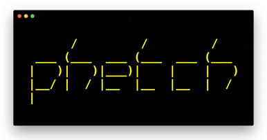

    
       
    
    
    

`phetch` is a terminal gopher client designed for quick keyboard navigation. It is the spiritual successor to [GILD](https://github.com/dvkt/gild).

**features:**

- small (<1MB) executable for linux and mac
- technicolor design
- no nonsense keyboard navigation

## usage

    phetch <gopher-url>    # Show Gopherhole at URL
    phetch -r <gopher-url> # Print raw Gopher response.
    phetch -h              # Show this screen.
    phetch -v              # Show phetch version.

## installation

Binaries for Linux and Mac are available at https://github.com/dvkt/phetch/releases

Just unzip/untar the `phetch` program into your $PATH get going!

You can also build from source using `cargo build --release`, if you want. 

## development

    cargo run -- <gopher-url>

## resources

- [rfc 1346](https://tools.ietf.org/html/rfc1436)
- http://ascii-table.com/ansi-escape-sequences.php
- http://www.lihaoyi.com/post/BuildyourownCommandLinewithANSIescapecodes.html

## TODO

### Basics
- [ ] open local files
- [ ] download to ~/Downloads
- [ ] `?` to show all keyboard shortcuts
- [ ] save history to file
- [ ] load history from file
- [ ] load most recent URL when opening without args
### Bonus
- [ ] async gopher request
- [ ] TLS
- [ ] fuzzy find search links
    - https://github.com/stewart/rff
    - https://github.com/Schlechtwetterfront/fuzzy-rs
- [ ] detect SIGWINCH
    - https://github.com/BurntSushi/chan-signal

## Screenies

