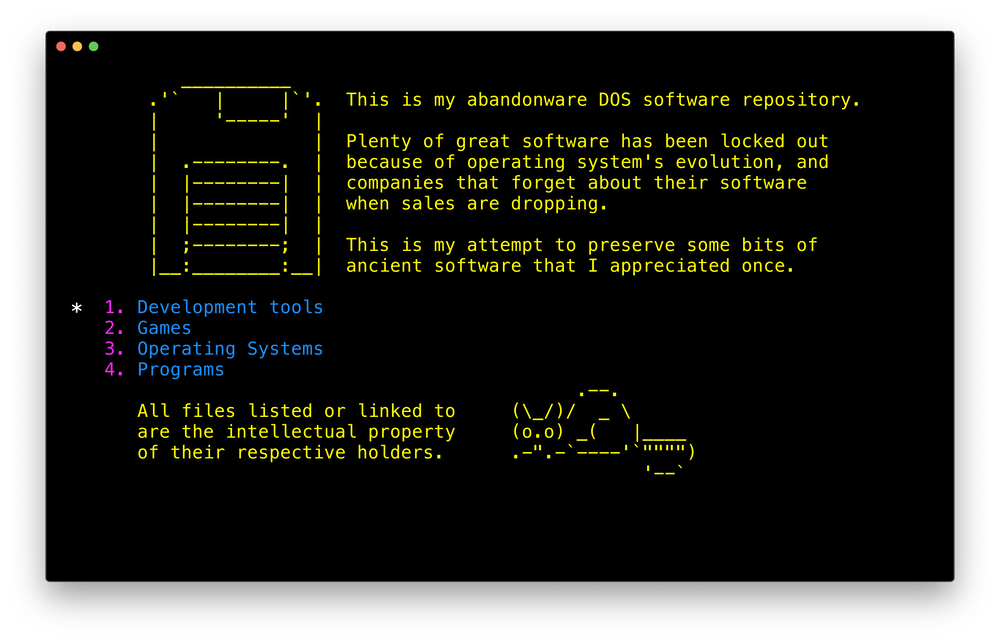
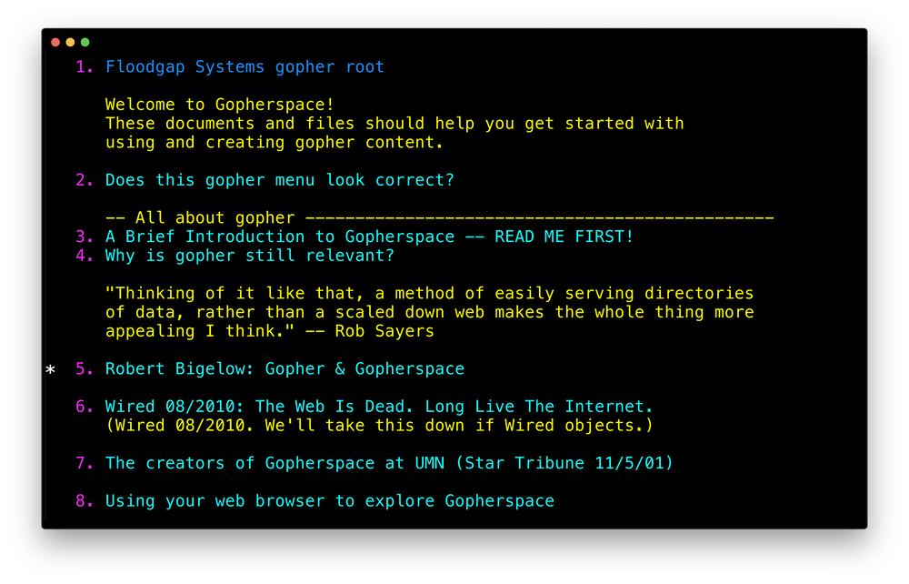
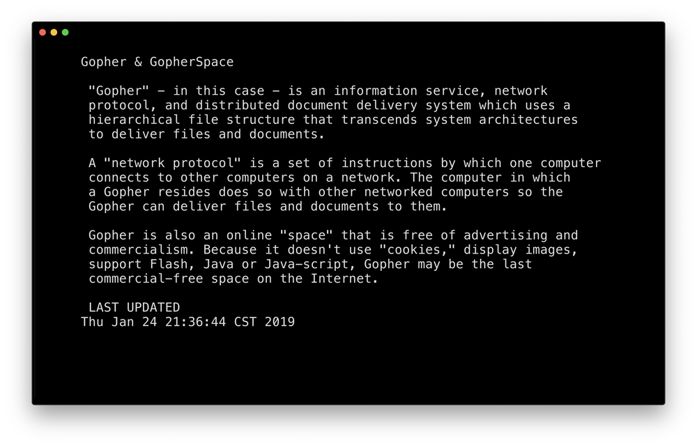

<!--
      /         /         /
 ___ (___  ___ (___  ___ (___
|   )|   )|___)|    |    |   )
|__/ |  / |__  |__  |__  |  /
|
--> 
   

`phetch` is a terminal client designed to help you quickly navigate
the gophersphere.

## features

- <1MB executable for linux and mac
- technicolor design (based on [GILD](https://github.com/dvkt/gild))
- no-nonsense keyboard navigation
- supports gopher searches, text and menu pages, and downloads
- save your favorite gopherholes with bookmarks
- opt-in history
- secure gopher support (TLS)

## usage

    phetch                           launch and show start page
    phetch <gopher-url>              open gopher url
    phetch -t, --tls <gopher-url>    attempt to open w/ tls
    phetch -r, --raw <gopher-url>    print raw gopher response
    phetch -l, --local               connect to 127.0.0.1:7070
    phetch -h, --help                show this screen
    phetch -v, --version             show phetch version

    once you've launched phetch, use `ctrl-h` to view the on-line help.

## installation

binaries for linux, mac, and raspberry pi are available
at https://github.com/dvkt/phetch/releases:

- [phetch-v0.1.11-linux-x86_64.tgz][0]
- [phetch-v0.1.11-linux-armv7.tgz (RPi)][1]
- [phetch-v0.1.11-macos.zip][2]

just unzip/untar the `phetch` program into your $PATH and get going!

## updates

to check for new versions of `phetch`, use the on-line help system in
the app (`ctrl-h`) or visit:

    gopher://phkt.io/1/phetch/latest

## development

    cargo run -- <gopher-url>

*pro-tip:* run a local gopher server on `127.0.0.1:7070` and start
phetch with `-l` or `--local` to quickly connect to it.

to build with TLS support on **linux**, you need `openssl` and
`pkg-config`:

    sudo apt install -y pkg-config libssl-dev

to build without TLS support, build with the `no-tls` feature:

    cargo build --features disable-tls

you can check whether TLS is enabled by visiting the About page:

    cargo run --features disable-tls -- gopher://phetch/about

## screenies

## todo

- [ ] fork+exec telnet: gopher://bitreich.org/1/lawn/bbs
- [ ] ~/.config/phetch/phetch.conf

## bugs

- [ ] "stream did not contain valid UTF-8"  sdf.org/maps/
- [ ] ctrl-z (suspend) doesn't work
- [ ] unknown keypress: \n needs escaping
- [ ] unknown keypress: [ during status messages
- [ ] gopher://1436.ninja/1/twit.cgi ("iWritten and performed by
  Nathaniel" weirdness) (kitty only)
- [ ] gopherpedia 'recent entries' weirdness (also kitty only)
- [ ] gopher://alexschroeder.ch/2020-01-02_This_Gopher_Hole/menu

## v1.0

- [ ] Changelog generation (for gopher and github)
- [ ] GIF screencast
- [ ] man page (small one)

## future features

- [ ] track binary size per release
- [ ] text views are menus when URLs are present (one per line max)
- [ ] Find Text in Text views
- [ ] fuzzy find incremental search
- [ ] persistent history
- [ ] bookmarks: toggle instead of just prepending to the file
- [ ] bookmarks: save the title of the current page

[0]: https://github.com/dvkt/phetch/releases/download/v0.1.11/phetch-v0.1.11-linux-x86_64.tgz
[1]: https://github.com/dvkt/phetch/releases/download/v0.1.11/phetch-v0.1.11-linux-armv7.tgz
[2]: https://github.com/dvkt/phetch/releases/download/v0.1.11/phetch-v0.1.11-macos.zip
