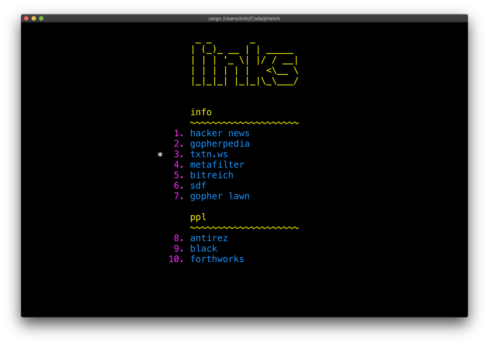

    
       
    
    
    

`phetch` is a terminal client designed to quickly navigate the gophersphere.

**features:**

- <1MB executable for linux and mac
- technicolor design (based on [GILD](https://github.com/dvkt/gild))
- no nonsense keyboard navigation

## usage

    phetch                 # Launch and show start page.
    phetch <gopher-url>    # Launch and show Gopherhole at URL.
    phetch -r <gopher-url> # Print raw Gopher response.
    phetch -h              # Show help.
    phetch -v              # Show version.

Once you've launched phetch, use `ctrl-h` to view the on-line help.

## installation

Binaries for Linux and Mac are available at https://github.com/dvkt/phetch/releases

Just unzip/untar the `phetch` program into your $PATH and get going!

## development

    cargo run -- <gopher-url>

## screenies

## todo

- [ ] new screenshots
- [ ] little GIF screencast in README
- [ ] telnet: gopher://bitreich.org/1/lawn/bbs

## bugs

- [ ] gopher://1436.ninja/1/twit.cgi ("iWritten and performed by Nathaniel" weirdness)

## future features

- [ ] Incremental search in Text views
- [ ] Linked gopher and http URLs in Text views
- [ ] TLS -- https://dataswamp.org/~solene/2019-03-07-gopher-server-tls.html
- [ ] Fuzzy Find incremental search
